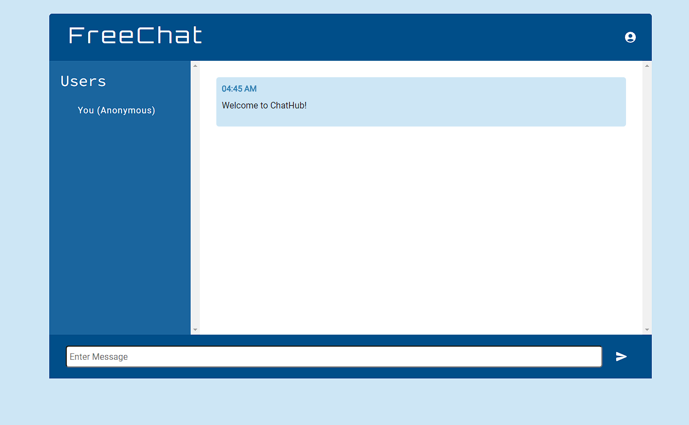

# FreeChat

[FreeChat Link](https://lit-dawn-31381-c68ed5d010dd.herokuapp.com/)

## Description

This is a socket.io chatting web application that allows users to send and receive messages from others to communicate in real-time.

After creating an account, users will be able to join a global chatroom and communicate freely with others, or specifically choose someone to send whispers to.

## Table of Contents

* [User Stories](#user-stories)

* [Technologies Used](#technologies-used)

* [Usage](#usage)

* [Questions](#questions)

## User Stories

* User is able to chat with other users by sending and receiving messages in real-time
* User can create an account and login to be identified by their username
* User can whisper to other users
* User can see who is currently logged in with the users list

## Technologies Used

* [x] JavaScript (ES6+)
* [x] React.js
* [x] Node.js
* [x] Express.js
* [x] MySQL2
* [x] Sequelize
* [x] Socket.io
* [x] MaterialUI
* [x] Bootstrap
* [x] Deployed on Heroku

## Usage

Deployed application: [FreeChat](https://lit-dawn-31381-c68ed5d010dd.herokuapp.com/)

Register or Log in; attempting to send messages without doing so will prompt the user to login or sign up.

When logged in, the user will be able to see their username added to the user list on the left so long as they are connected and logged in. They can then send messages globally to all users or by using the command "/w [username] [message]" they will be able to whisper to a specific user provided that the recipient is also online.

The whisper command can also be easily accessed by selecting a user from the online user list, which will automatically input the "/w [username] " portion of the command.

More features are yet to be implemented, such as message history, topic rooms, and mini-game functionality.

## Questions

If you have any questions about this repository, open an issue or contact me at jthnguyen9909.work@gmail.com. You can find more of my work at [jthnguyen9909](https://github.com/jthnguyen9909).
